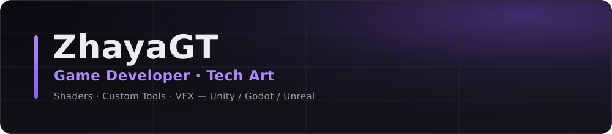

  

  
  
  

 

  

## About

Game developer focused on **tech art**. I write shaders, build custom editor tools, and set up VFX
systems — the layer between the artist's intent and what the engine actually draws.

- **Shader authoring** — Shader Graph and hand-written HLSL: fullscreen post-processing, stylized
  materials, AR overlays.
- **Custom tools** — editor extensions and standalone utilities that remove repetitive work from a
  production pipeline.
- **VFX & rendering** — reactive post-processing driven by gameplay state, not just static looks.
- **Gameplay** — designing and shipping small games end to end, from prototype to a playable build.

## Games

Playable builds are published on **[zhayagt.itch.io](https://zhayagt.itch.io/)**.

<table>
<tr>
<td width="50%" valign="top">

### [Memorize IT](https://zhayagt.itch.io/memorize-it)
Memory and observation game — remember the arrangement of a set of objects, then reproduce it.
Full gameplay loop, menu flow, and audio.

`Unity` `C#` `Released`

</td>
<td width="50%" valign="top">

### [Vortex Velocity](https://zhayagt.itch.io/vortex-velocity)
Drone racing game. Reach the finish line through obstacle courses while competing against other
drones. WASD flight controls.

`Unity` `C#` `Racing`

</td>
</tr>
<tr>
<td width="50%" valign="top">

### [Forest Adventure](https://zhayagt.itch.io/forest-adventure)
Side-scrolling platformer built for the Politeknik Negeri Malang assignment track. Level
progression, finish zones, and dissolve-based scene transitions.

`Unity` `C#` `Platformer`

</td>
<td width="50%" valign="top">

### [Gak Tamat = Skill Issue](https://zhayagt.itch.io/gak-tamat-skill-issue)
Top-down shooter — WASD to move, space to fire. Built solo.

`Unity` `C#` `Shooter`

</td>
</tr>
</table>

Other Unity projects live in the [repository list](https://github.com/ZhayaGT?tab=repositories):
*The Statistic Adventure* (game paired with a fuzzy-logic simulation core), *Game Kartu 21*
(blackjack), *Aku Telat!* (endless runner), and *KMIPN — Midnight Moderator* (team entry for
GEMASTIK 2026).

  

## Tech art & tools

<table>
<tr>
<td width="50%" valign="top">

### [ShaderSnap](https://github.com/ZhayaGT/ShaderSnap)
Export a Unity Shader Graph as a clean, readable PNG. Parses the `.shadergraph` asset and re-lays the
graph out deterministically instead of screenshotting the editor — even spacing, wires routed around
nodes, Shader Graph's own styling, legible at any resolution.

`C#` `Unity` `Tooling`

</td>
<td width="50%" valign="top">

### [Horror Shader Showcase](https://github.com/ZhayaGT/Horror-Shader-Showcase)
Post-processing collection built with Fullscreen Shader Graph on Unity 6.3 / URP. Sanity and reality
systems: screen warping for hallucination, heartbeat-reactive vignette, and other visual feedback
tied to the character's psychological state.

`Shader Graph` `URP` `Unity 6.3`

</td>
</tr>
</table>

  

## Tech stack

  

## Stats

  
  

  

 

  Open to collaboration on shaders, tools, and rendering work.

